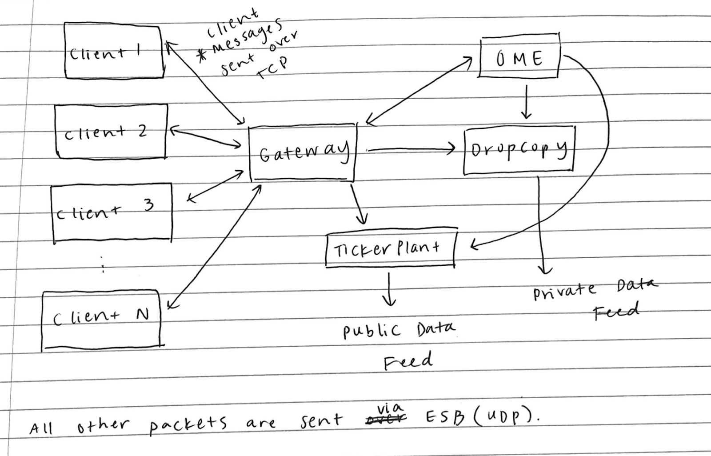
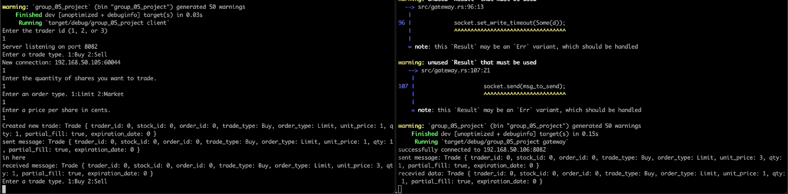

# Orderbook-based Mini-Exchange with an Order Matching Engine, Gateway, Dropcopy and Tickerplant

## Project Description:
An orderbook-based mini-exchange using the programming language Rust. The program consists of four primary applications: a gateway, an order matching engine, a dropcopy, and a market data ticker plant, as well as client machines to interact with the exchange.

Traders connect directly to the gateway using TCP to send orders and receive order updates. Currently traders input orders using a basic command line interface. After the order is submitted, it is sent to the Gateway where the information contained in the order is validated. If it is valid, the trade is sent to the order matching engine using UDP multicast. The matching engine receives orders and determines if the incoming order matches with any resting orders on the book. If no trades can be executed, and the incoming order is a limit order, we rest the order on the orderbook. Otherwise we use the gateway to send information back to the client indicating that the trade was not executed. The tickerplant publishes public market data using UDP multicast whenever a trade is executed. The dropcopy aggregates all private market data related to a single company and sends it to the main trader/client from the company.

## Technologies:

In order to develop and build our exchange we utilized a variety of technologies. The main technologies we used included Rust, CI/CD & RPI, UFW Firewall, Vagrant & VM, and Git.

### Rust:

In order to develop a fast and efficient system we decided to choose a systems programming language. We chose Rust as our primary development language instead of C or C++ as Rust is a newer language that has been becoming increasingly popular among developers and we wanted to gain more experience using it in a project.

### Vagrant & VM:

Virtual machines (VMs) were used for each component of the project so the system architecture could be as similar to a real world exchange as possible. The virtual machines ran a slightly modified version of CentOS that was designed to use minimal compute resources. In order to simplify VM creation and management the software called Vagrant was used. Vagrant allows us to automate the creation of virtual machines and simplifies the process of managing and configuring a set of VMs.

## Components:

#### Gateway:

The gateway is the middle-man between the clients and the rest of the exchange. Clients communicate with the gateway to send orders and receive updates on submitted orders. The clients and gateway communicate via the transfer control protocol (TCP).  TCP is a reliable protocol (meaning dropped packets are automatically retransmitted), packets are ordered, and is unicast (one to one only). TCP is ideal for this component of the exchange compared to UDP as we can not have packets being dropped and need to ensure the ordering of trades.

### Client:
The client represents a single trader submitting orders to the exchange. They only interact with the gateway via TCP. Additionally all the clients have a UDP multicast listener to pick up packets from the ticker plant and dropcopy.

### Order Matching Engine:

The order matching engine receives the orders that were sent from the client through the gateway. It then utilizes an orderbook to determine if the order matches with any current resting orders and then adds that order to the order book and sends the result to the esb, dropcopy, and tickerplant.  An orderbook is an electronic list of buy and sell orders for a specific security or financial instrument organized by price level. Orderbook’s help improve market transparency as they provide information on price, availability, depth of trade, and who initiates transactions. The order matching engine utilizes UDP multicast to send packets reflecting changes to the order book to other internal components of the exchange simultaneously.

### Ticker Plant:

The market data ticker plant utilizes the information sent from the order matching engine and creates a market data book update message. The tickerplant data update message is sent using UDP multicast, to which multiple clients can connect to and ensure simultaneous receipt of market data to avoid providing unfair advantages to a few clients.  

### Dropcopy:

The dropcopy aggregates order and trade data for a single trading entity across all of its clients. The data that the gateway sends to each client is replicated in a single stream to a single machine, often used as a kill switch system at the broker-dealer. For example, one broker-dealer that has 10 different trading desks, each with its own connection to the gateway, can have a single back-office system that receives data from the dropcopy, to provide a holistic view of all of their trades.

## Git Repo Layout:

- On the main branch, src/ has all of our code
- Everything is run from src/main.rs
- In order to run our project you must have cargo, rust, and vagrant installed locally on your computer.
- All other branches contain code that is being worked and should not be used to run any part of the project.

## Instructions to Run Project:

First clone our repository using 
- `git clone https://gitlab.engr.illinois.edu/ie598_high_frequency_trading_spring_2022/ie498_hft_spring_2022_group_05/group_05_project.git` 

Then open the project directory using:
- `cd group-05-project`

To generate, provision, and turn on the VMs, run vagrant up. Make sure that VirtualBox or another VM manager is installed. We have already installed all the prerequisite software that the VMs need to run.
- `vagrant up`

To access a VM, we need to SSH into it. Open a new terminal for each entity in the Vagrantfile and ssh into the respective entity. Then clone or download our repository in EACH entity. This clone can be done using the above `git clone` command. 

To run a specific entity, we can provide command line arguments that specify the name of the VM. Below is an example of SSH’ing into a single VM and running that entity.

`vagrant status      # lists the names and statuses of all of the VMs`

`vagrant ssh gateway # ssh's into the gateway VM`

`cargo run gateway # actually runs the gateway` 

Make sure that each entity is up and running BEFORE you start the gateway. For the client specifically, there will be STDIN prompts that the user will need to provide to generate the orders. If you do not want to do this manually, you can create a simple python script that periodically pipes data into the STDIN of the client entity.

The VM names, as specified in the vagrant file, and the corresponding cargo run commands are as follows.

- gateway - cargo run gateway
- ome - cargo run ome
- dropcopy - cargo run dropcopy
- tickerplant - cargo run tickerplant
- trader1 - cargo run client
- trader2 - cargo run client
- trader3 - cargo run client

## Testing:
There is a basic ci/cd pipeline that is able to run a test suite. For system/integration testing, we wrote a bash script to be run on the same machine as one of the clients, simulating a trading desk actually using the exchange.

Above is an example of our client-gateway communication. On the left-hand side, is the client running with after a trade was input and sent to the gateway. On the right-hand side, is the gateway that has recieved and is displaying the trade from the client.
[[[[[[[[[[[[[[[[[[
